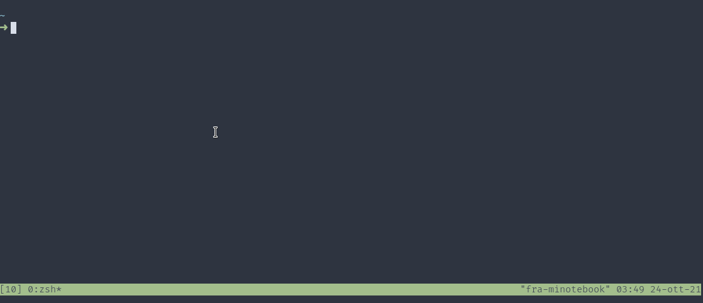

# AZS

[kubectx/kubens](https://github.com/ahmetb/kubectx) clone for AZ CLI subscriptions.




## Build

```bash
git clone https://www.github.com/filariow/azs
cd azs
make build
```

After the build, you can find the the binary at `./bin/azs`.


## Install

Download latest [release](https://github.com/filariow/azs/releases), unzip it and install the binary

On Linux:

```bash
unzip azs*.zip
sudo install azs /usr/local/bin
rm azs*.zip azs
```

